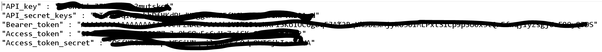
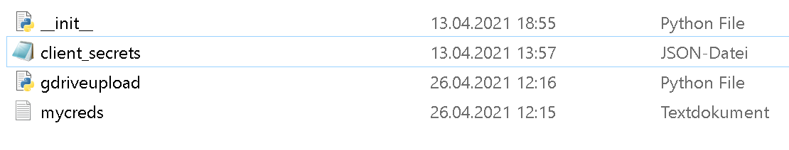

# ReadMe of Twitter Streaming

This Folder is built for the purpose to stream Tweets from Twitter-Api. It gets the newest Tweets from a predefined search_key, which will be running 
until the process is finished manually.

THe data will be collected and saved in the "data" folder. Then the files will be concatenated to one big .csv file. This process will be performed each minute to 
ensure to have the latest tweets. Pay attention to the Rate Limits, which is with v.1.1 API of Twitter 15 requests per 15 minutes. The tweeet sare also limited to a specific amount.
If enough tweets have been collected then the file gdriveupload can be executed to upload the files to a certain Google Drive folder. This needs to be adapted first with a correct 
folder ID changed to one in your personal GoogleDrive Account.

## Procedure for the Usage

1. Type in your preferred search key for Twitter in the "executable.py"
2. Save your Twitter-API Credentials in the same folder of the "executable.py" with following structure:

3. Save your GoogleDrive API Credentials to the folder "integrate":

4. Run the "executable.py" python script.
5. Collection of Tweets starts.
